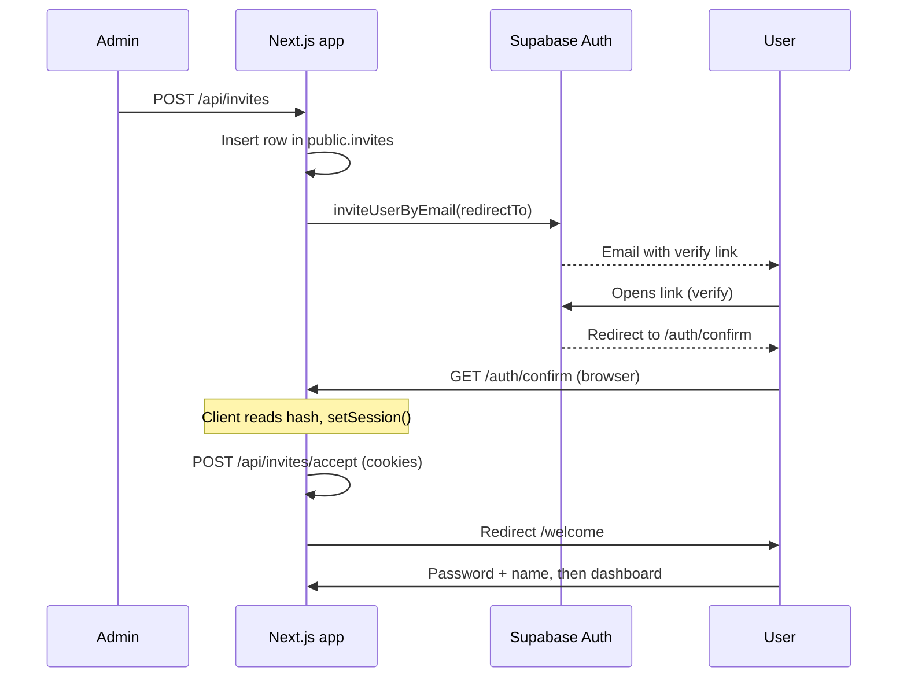

# Team invites, Supabase Auth, and first-time setup

This document explains how **team invitations**, **email confirmation**, and **welcome (password + profile)** work in this app. Use it when standing up a new environment or debugging “invite worked on localhost but not on Vercel” issues.

---

## Mental model

1. **Invite email** is sent by **Supabase Auth** (`auth.admin.inviteUserByEmail`), not by our app’s SMTP.
2. The link in that email goes through **Supabase’s verify endpoint**, then **redirects to your app** with session material in the URL.
3. For **invite / magic-link style flows**, Supabase typically puts tokens in the **URL hash** (`#access_token=...&refresh_token=...`), not in `?code=...`.
4. **Hash fragments are never sent to the server.** A Next.js **Route Handler** (`route.ts`) cannot read them. Only **browser JavaScript** can.
5. Therefore **`/auth/confirm` must be a client page** that parses the hash, calls `setSession`, then calls a **server API** to join the org.



---

## One-time: Supabase Dashboard (correct project)

Always confirm you are in the **same** Supabase project as your `NEXT_PUBLIC_SUPABASE_URL`.

### Authentication → URL Configuration

| Setting | Typical value (production) |
|--------|------------------------------|
| **Site URL** | `https://<your-app>.vercel.app` (or your custom domain root) |
| **Redirect URLs** | `https://<your-app>.vercel.app/auth/confirm`<br>`https://<your-app>.vercel.app/auth/callback`<br>`https://<your-app>.vercel.app/auth/callback?next=recovery` |

Notes:

- **Do not** rely on `http://localhost:3000` in production. The invite email’s `redirect_to` is built from **`NEXT_PUBLIC_APP_URL`** in Vercel; if that points at localhost, invited users will be sent to your laptop.
- You can add **both** local and production URLs during development, e.g. `http://localhost:3000/auth/confirm` and `https://<prod>/auth/confirm`.
- **`/auth/callback`** is used for **PKCE** flows: OAuth (if enabled), **password reset** (`exchangeCodeForSession` in `app/auth/callback/route.ts`). The **invite** flow uses **`/auth/confirm`** (hash tokens).
- **Password reset:** “Forgot password?” calls `resetPasswordForEmail` with `redirectTo = ${origin}/auth/callback?next=recovery`. Add that **exact** URL (prod + localhost) to **Redirect URLs** if Supabase rejects the redirect. After exchange, the app sends recovery sessions to **`/auth/update-password`**. Recovery initiated from the Supabase dashboard may omit `?next=recovery`; the server also detects recovery via the access token **`amr`** claim when present.

### Service role

`POST /api/invites` uses the **service role** client to call `inviteUserByEmail` and related admin APIs. The **service role key** must be set only on the server (e.g. `SUPABASE_SERVICE_ROLE_KEY` in Vercel), never exposed to the browser.

---

## Environment variables (Vercel)

| Variable | Purpose |
|----------|---------|
| `NEXT_PUBLIC_APP_URL` | Base URL of the deployed app, e.g. `https://splyts-os.vercel.app`. Used to build `redirectTo` for `inviteUserByEmail`. |
| `NEXT_PUBLIC_SUPABASE_URL` | Supabase project URL. |
| `NEXT_PUBLIC_SUPABASE_ANON_KEY` | Public anon key (browser + server). |
| `SUPABASE_SERVICE_ROLE_KEY` | Server-only; invites, RPC that needs elevated access, `deleteUser`, etc. |

If `NEXT_PUBLIC_APP_URL` is wrong, the email link will point at the wrong host even when Supabase URL settings are correct.

---

## Code map

| Piece | Role |
|-------|------|
| `app/api/invites/route.ts` | Admin creates invite row + calls `inviteUserByEmail` with `redirectTo = ${APP_URL}/auth/confirm`. Handles 422 (user exists), 429 (rate limit), orphan invite cleanup. |
| `app/auth/confirm/page.tsx` | **Client only:** reads `#access_token` / `#refresh_token`, `setSession`, then `POST /api/invites/accept`. |
| `app/api/invites/accept/route.ts` | Authenticated user: find pending invite **by email**, accept into `organization_members`. |
| `lib/queries/team.ts` | `getPendingInviteByEmail`, `acceptInviteById`, `revokeInvite` (soft-delete invite + delete unconfirmed Auth user). |
| `app/welcome/page.tsx` + `components/auth/welcome-form.tsx` | First-time profile: **password** (`updateUser`) + name, then `PUT /api/profile`. |
| `app/auth/callback/route.ts` | Exchanges `?code=` for a session; invite + `invite_token` → `/welcome`; password recovery → `/auth/update-password`; else → `/dashboard`. |
| `app/auth/update-password/page.tsx` + `components/auth/update-password-form.tsx` | After reset link: **new password** (`updateUser`), then dashboard. |
| `components/auth/login-form.tsx` | **Forgot password?** → `resetPasswordForEmail` with `redirectTo` including `next=recovery`. |
| `lib/auth/recovery-session.ts` | Reads JWT **`amr`** for `recovery` to route dashboard-sent reset emails. |
| `supabase/migrations/*get_auth_user_by_email*` | RPC to read `auth.users` by email (PostgREST cannot query `auth` schema directly). Used for 422 handling and revoke. |

---

## Why not a server `route.ts` at `/auth/confirm`?

A server route can exchange **`?code=`** (PKCE) for a session—**if** Supabase redirects with a query code. **Invite emails in practice** often redirect with **hash tokens**. The server never sees the hash, so it will look like “no code” and fail.

The reliable approach here: **client page** + `setSession` from hash, then **cookie-based** API for org membership.

---

## `redirectTo`: clean URL (no query string)

`inviteUserByEmail` is called with:

```text
redirectTo = ${NEXT_PUBLIC_APP_URL}/auth/confirm
```

Keeping **`/auth/confirm` without extra query parameters** avoids ambiguous redirects when providers append `?code=` or other params. The app does **not** need `invite_token` in the URL: after `setSession`, we know the user’s **email** and can match a pending row in `public.invites`.

---

## Database: `get_auth_user_by_email`

PostgREST cannot query `auth.users` from the client types. A **`SECURITY DEFINER`** SQL function (see `supabase/migrations/20260326_get_auth_user_by_email_fn.sql`) returns `(user_id, is_confirmed)` for an email. **`service_role`** is granted `EXECUTE`.

Used when:

- **422** on invite: user already exists—if **unconfirmed**, delete via `auth.admin.deleteUser` and retry; if **confirmed**, tell admin to use a different email or sign-in.
- **Revoke pending invite**: after soft-invalidating the invite, delete the **unconfirmed** Auth user so the same email can be invited again.

---

## Edge cases

### Email rate limit (429)

Supabase limits how often email can be sent to the same address. The API returns a clear message and should delete the orphaned `invites` row if `inviteUserByEmail` fails.

### “User already exists” (422)

Handled by looking up Auth via `get_auth_user_by_email` and deleting **unconfirmed** users only. Never delete confirmed users from an invite retry.

### Revoking a pending invite

`revokeInvite` marks the invite as accepted (invalidates it) and removes the **unconfirmed** Auth user if present so re-invite works.

---

## First-time user after invite

1. Lands on `/auth/confirm` → session from hash → `POST /api/invites/accept` → org membership.
2. Redirect to `/welcome`.
3. Sets **password** (client `updateUser`) and **profile** (API). Dashboard layout may redirect users without a name back to `/welcome`.

---

## New environment checklist

- [ ] Create Supabase project (or use existing).
- [ ] Run all migrations (including `get_auth_user_by_email`).
- [ ] Set **Site URL** and **Redirect URLs** for `/auth/confirm` (prod + local if needed).
- [ ] Set Vercel env: `NEXT_PUBLIC_APP_URL`, Supabase URL/keys, **service role** server-side only.
- [ ] Send a test invite to yourself; confirm the link host matches production.
- [ ] Complete `/welcome` and sign out, then sign in with **email + password**.

---

## Related files (quick reference)

- `app/api/invites/[id]/route.ts` — DELETE revoke (admin).
- `app/dashboard/layout.tsx` — redirect to `/welcome` if profile has no name.
- `lib/supabase/client.ts` — browser Supabase client for `setSession` / `updateUser`.

This setup is tuned for **Next.js App Router** + **@supabase/ssr** + **inviteUserByEmail**. If you change auth methods (OAuth-only, different email templates), revisit `/auth/confirm` and redirect URLs accordingly.
